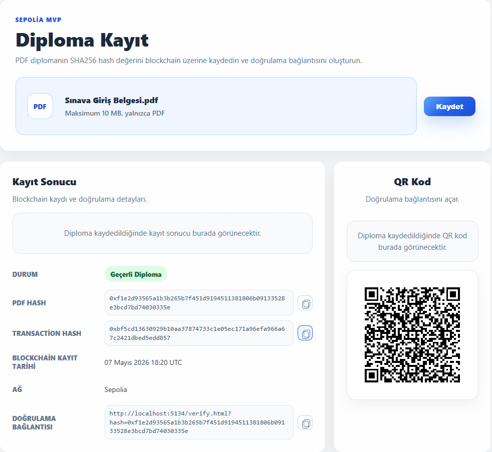
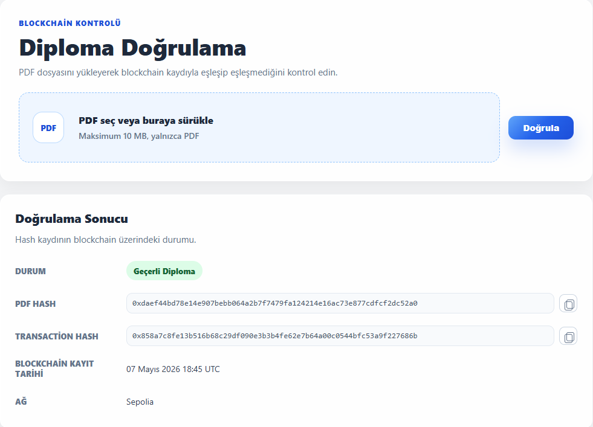
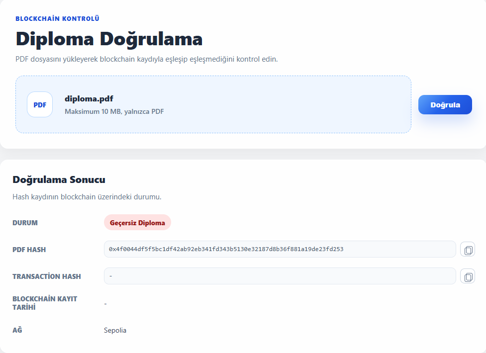
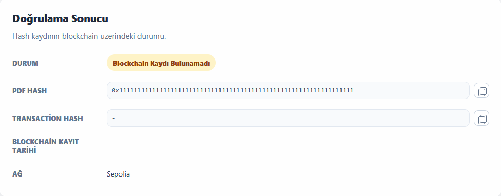

# Blockchain-Based Diploma Verification System (MVP)


## 1. Proje Özeti

**Blockchain-Based Diploma Verification System (MVP)**, PDF formatındaki diplomaların bütünlüğünü ve doğrulanabilirliğini Ethereum Sepolia ağı üzerinde sağlayan bir doğrulama sistemidir.

Bu sistemde diplomanın orijinal PDF içeriği blockchain'e kaydedilmez. Bunun yerine, PDF dosyasından üretilen **SHA-256 hash değeri** akıllı sözleşme üzerinde saklanır. Böylece:

- Diploma içeriği gizli kalır.
- Blockchain üzerinde değiştirilemez, timestamp içeren bir kayıt oluşur.
- PDF üzerinde yapılacak en küçük değişiklik farklı bir hash üreteceği için belge doğrulaması başarısız olur.

Bu yaklaşım, **privacy-preserving verification** ve **immutable proof of existence** prensiplerini bir araya getirir.

## 2. Temel Özellikler

| Özellik | Açıklama |
| --- | --- |
| **Immutable Storage** | Diploma hash kayıtları Ethereum Sepolia Testnet üzerinde smart contract aracılığıyla tutulur. |
| **SHA-256 Hashing** | PDF dosyasının içeriğinden deterministik SHA-256 hash değeri üretilir. |
| **Otomatik QR Kod** | Başarılı kayıt sonrası doğrulama URL'si için otomatik QR kod oluşturulur. |
| **Mükerrer Kayıt Engelleme** | Aynı PDF hash değerinin ikinci kez kaydedilmesi smart contract seviyesinde engellenir. |
| **Gerçek Zamanlı Doğrulama** | Yüklenen PDF'in hash değeri blockchain kaydıyla anlık olarak karşılaştırılır. |
| **Gizlilik Odaklı Tasarım** | Blockchain üzerinde yalnızca hash ve timestamp saklanır; diploma dosyasının içeriği kaydedilmez. |

## 3. Teknoloji Yığını

| Katman | Teknolojiler |
| --- | --- |
| **Backend** | ASP.NET Core 10, C#, Nethereum, QRCoder |
| **Blockchain** | Solidity Smart Contract, Ethereum Sepolia Testnet, Alchemy RPC |
| **Frontend** | HTML5, CSS3, JavaScript |
| **Hashing** | SHA-256 |
| **Deployment/Test** | Hardhat, Sepolia Faucet, Alchemy |

## 4. Mimari Yapı

Proje, sürdürülebilirlik ve test edilebilirlik hedeflenerek servis odaklı bir yapıda geliştirilmiştir.

| Mimari Prensip | Uygulama Yaklaşımı |
| --- | --- |
| **SOLID** | Hash üretimi, QR kod üretimi, doğrulama bağlantısı ve blockchain entegrasyonu ayrı servis sorumluluklarına bölünmüştür. |
| **Clean Architecture** | Controller katmanı iş akışını yönetir; domain davranışları servisler üzerinden izole edilir. |
| **Repository Pattern Yaklaşımı** | Blockchain smart contract, kalıcı veri kaynağı gibi ele alınır; erişim `IDiplomaBlockchainService` arayüzü arkasında soyutlanır. |
| **Service-Oriented Design** | PDF validasyonu, SHA-256 dönüşümü, Nethereum çağrıları ve QR üretimi bağımsız servisler üzerinden yürütülür. |

### Kritik Mimari Bileşenler

| Sınıf | Katman | Neden Kritik? | Stratejik Rol |
| --- | --- | --- | --- |
| `DiplomaController` | API / Orchestration | Sistemin dış dünyaya açılan ana giriş noktasıdır. `/upload`, `/verify` ve `/verification/{hash}` akışlarını yönetir. | PDF doğrulama, blockchain kaydı, QR üretimi ve response modelleme süreçlerini koordine eder. Servisleri arayüzler üzerinden kullanarak katmanlar arası bağımlılığı düşük tutar. |
| `PdfHashService` | Core Logic / Validation | Diploma doğrulamasının temel güvenlik noktasıdır. PDF validasyonu, boyut kontrolü, dosya imzası kontrolü ve SHA-256 hash üretimi burada yapılır. | Blockchain'e yazılacak verinin güvenilir, deterministik ve şartnameye uygun üretilmesini sağlar. PDF içeriği saklanmadan yalnızca hash üzerinden doğrulama yapılmasının temelini oluşturur. |
| `DiplomaBlockchainService` | Infrastructure / Blockchain Integration | Nethereum üzerinden Sepolia smart contract ile iletişim kuran ana servis katmanıdır. Kayıt, doğrulama, duplicate kontrolü ve transaction bilgisi alma sorumluluklarını taşır. | Uygulama ile Ethereum ağı arasındaki kritik sınırı yönetir. Smart contract çağrılarını soyutlayarak API katmanının blockchain detaylarından bağımsız kalmasını sağlar. |
| `HexHashConverter` | Core Logic / Type Conversion | Backend'de üretilen SHA-256 hash değeri hex string formatındadır; smart contract ise `bytes32` bekler. Bu dönüşüm hatasız yapılmazsa blockchain entegrasyonu çalışmaz. | Hash formatını normalize eder, 32 byte uzunluk ve hexadecimal geçerlilik kontrollerini yapar. C# ile Solidity arasındaki veri tipi uyumluluğunu garanti eder. |
| `VerificationLinkService` | Application Service / URL Generation | QR kodun yönlendirdiği doğrulama bağlantısını üretir. `VerificationBaseUrl` boş olduğunda çalışma anındaki host ve port üzerinden dinamik URL oluşturur. | Ortama bağımlılığı azaltır ve local/deployment senaryolarında doğrulama linklerinin doğru host üzerinden üretilmesini sağlar. QR tabanlı doğrulama akışının merkezinde yer alır. |

Temel veri akışı:

```text
Frontend
  ↓
ASP.NET Core API
  ↓
PDF Validation
  ↓
SHA-256 Hash Generation
  ↓
Nethereum Integration
  ↓
Ethereum Sepolia Smart Contract
  ↓
Verification Result + QR Code
```

### API Endpointleri

| Method | Endpoint | Amaç | Başarılı Yanıt |
| --- | --- | --- | --- |
| `POST` | `/upload` | PDF dosyasını validate eder, SHA-256 hash üretir, hash değerini Sepolia smart contract üzerine kaydeder ve QR kod üretir. | `Geçerli Diploma`, PDF hash, transaction hash, timestamp, ağ bilgisi, doğrulama URL'si ve QR kod data URL |
| `POST` | `/verify` | Kullanıcının yüklediği PDF dosyasının hash değerini üretir ve blockchain kaydıyla karşılaştırır. | `Geçerli Diploma` veya `Geçersiz Diploma` |
| `GET` | `/verification/{hash}` | QR kod / doğrulama linki üzerinden gelen hash değerini blockchain üzerinde sorgular. | `Geçerli Diploma` veya `Blockchain Kaydı Bulunamadı` |

### Smart Contract Yapısı

Smart contract, PDF içeriğini değil yalnızca SHA-256 hash değerini ve kayıt zamanını saklar.

```solidity
struct Diploma {
    bool exists;
    uint256 timestamp;
}
```

| Contract Bileşeni | Açıklama |
| --- | --- |
| `mapping(bytes32 => Diploma)` | Her PDF hash değerini ilgili diploma kaydıyla eşleştirir. |
| `registerDiploma(bytes32 pdfHash)` | Yeni diploma hash kaydı oluşturur. Aynı hash daha önce kayıtlıysa işlemi reddeder. |
| `verifyDiploma(bytes32 pdfHash)` | Verilen hash için kayıt olup olmadığını ve blockchain timestamp değerini döndürür. |
| `block.timestamp` | Kayıt zamanının zincir üzerindeki timestamp kaynağıdır. |

## 5. Demo

### Ekran Görüntüleri

| Ekran | Görsel |
| --- | --- |
| **Diploma Kayıt Ekranı** |  |
| **Başarılı Kayıt İşlemi** |  |
| **Geçerli Diploma Sonucu** |  |
| **Geçersiz Diploma Sonucu** |  |
| **Blockchain Kaydı Bulunamadı Sonucu** |  |

## 6. Kurulum (Setup)

### Gereksinimler

- .NET 10 SDK
- Node.js ve npm
- Sepolia RPC URL bilgisi (Alchemy önerilir)
- Sepolia Test ETH
- Deploy edilmiş `DiplomaRegistry` smart contract adresi

### Backend Kurulumu

```bash
dotnet restore
```

`appsettings.Local.json` dosyasını oluşturun:

```json
{
  "Blockchain": {
    "NetworkName": "Sepolia",
    "ChainId": 11155111,
    "RpcUrl": "https://eth-sepolia.g.alchemy.com/v2/YOUR_API_KEY",
    "PrivateKey": "YOUR_PRIVATE_KEY",
    "ContractAddress": "0xYOUR_CONTRACT_ADDRESS",
    "VerificationBaseUrl": ""
  }
}
```

> `PrivateKey`, RPC URL ve API anahtarları GitHub'a yüklenmemelidir. Bu bilgiler `.gitignore` kapsamındaki local config dosyalarında tutulmalıdır.

Uygulamayı çalıştırın:

```bash
dotnet run
```

### Smart Contract Kurulumu

```bash
cd blockchain
npm install
```

`.env` dosyasını oluşturun:

```env
SEPOLIA_RPC_URL=https://eth-sepolia.g.alchemy.com/v2/YOUR_API_KEY
PRIVATE_KEY=YOUR_DEPLOYER_PRIVATE_KEY_WITHOUT_0X
```

Contract testleri:

```bash
npm test
```

Sepolia deployment:

```bash
npm run deploy:sepolia
```

---

Bu MVP, diploma doğrulama senaryosunda belge gizliliğini korurken blockchain'in değiştirilemez kayıt yapısından yararlanır. Production ortamı için role-based access control, contract ownership, revocation mekanizması, audit logging ve CI/CD tabanlı deployment süreçleri eklenebilir.
