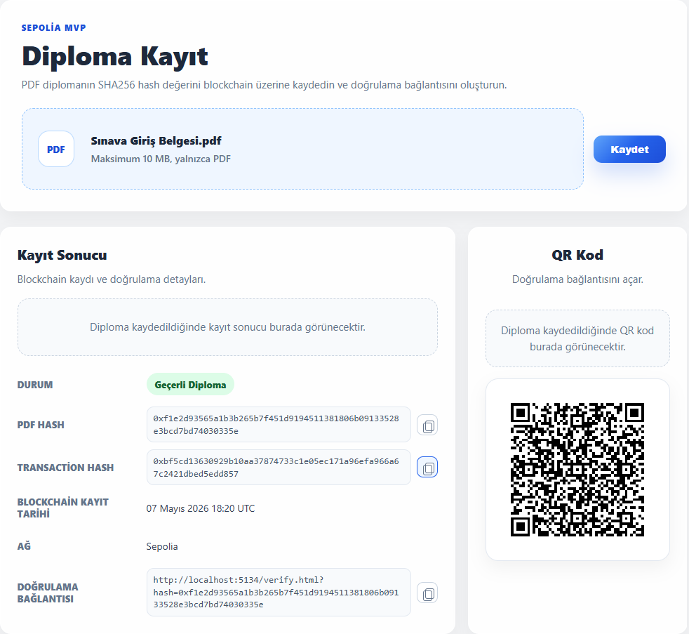

# Blockchain-Based Diploma Verification System


## 1. Proje Özeti

**Blockchain-Based Diploma Verification System**, PDF formatındaki diplomaların bütünlüğünü, kurumsal kaynağını ve doğrulanabilirliğini Ethereum Sepolia ağı üzerinde sağlayan rol tabanlı bir doğrulama sistemidir.

Bu sistemde diplomanın orijinal PDF içeriği blockchain'e kaydedilmez. Bunun yerine, PDF dosyasından üretilen **SHA-256 hash değeri**, üniversiteye ait issuer bilgisi ve kurumsal imza özeti smart contract üzerinde saklanır. Orijinal PDF ise uygulama tarafında `App_Data/diplomas` altında kayıt altına alınır. Böylece:

- Diploma içeriği gizli kalır.
- Blockchain üzerinde değiştirilemez, timestamp ve issuer bilgisi içeren bir kayıt oluşur.
- PDF üzerinde yapılacak en küçük değişiklik farklı bir hash üreteceği için belge doğrulaması başarısız olur.
- Diploma kaydının hangi üniversite tarafından üretildiği kurumsal imza ile doğrulanır.

Bu yaklaşım, **privacy-preserving verification** ve **immutable proof of existence** prensiplerini bir araya getirir.

## 2. Temel Özellikler

| Özellik | Açıklama |
| --- | --- |
| **Immutable Storage** | Diploma hash kayıtları Ethereum Sepolia Testnet üzerinde smart contract aracılığıyla tutulur. |
| **SHA-256 Hashing** | PDF dosyasının içeriğinden deterministik SHA-256 hash değeri üretilir. |
| **Rol Bazlı Yetkilendirme** | `Admin`, `University`, `Student` ve `Employer` rolleri ASP.NET Identity üzerinden yönetilir. |
| **Kurumsal İmza** | Her üniversite için RSA key pair üretilir; diploma kaydı üniversite private key'i ile imzalanır. |
| **PDF Arşivleme** | Kaydedilen PDF dosyaları hash tabanlı dosya adıyla `App_Data/diplomas` altında tutulur. |
| **Otomatik QR Kod** | Başarılı kayıt sonrası doğrulama URL'si için otomatik QR kod oluşturulur. |
| **Mükerrer Kayıt Engelleme** | Aynı PDF hash değerinin ikinci kez kaydedilmesi smart contract seviyesinde engellenir. |
| **Gerçek Zamanlı Doğrulama** | Yüklenen PDF'in hash değeri blockchain kaydıyla anlık olarak karşılaştırılır. |
| **Transaction Hash Persistence** | Başarılı kayıt transaction hash'i doğrulama ekranında garanti gösterilebilmesi için uygulama tarafında SQLite'a kaydedilir. |
| **Gizlilik Odaklı Tasarım** | Blockchain üzerinde yalnızca hash ve timestamp saklanır; diploma dosyasının içeriği kaydedilmez. |

## 3. Teknoloji Yığını

| Katman | Teknolojiler |
| --- | --- |
| **Backend** | ASP.NET Core 10, C#, ASP.NET Identity, EF Core SQLite, Nethereum, QRCoder |
| **Blockchain** | Solidity Smart Contract, Ethereum Sepolia Testnet, Alchemy RPC |
| **Frontend** | HTML5, CSS3, JavaScript |
| **Security** | SHA-256, RSA, ASP.NET Data Protection, Cookie Authentication |
| **Persistence** | SQLite, dosya sistemi tabanlı PDF arşivi |
| **Deployment/Test** | Hardhat, Sepolia Faucet, Alchemy |

## 4. Mimari Yapı

Proje, sürdürülebilirlik ve test edilebilirlik hedeflenerek servis odaklı bir yapıda geliştirilmiştir.

| Mimari Prensip | Uygulama Yaklaşımı |
| --- | --- |
| **SOLID** | Hash üretimi, QR kod üretimi, doğrulama bağlantısı, imza üretimi, PDF saklama ve blockchain entegrasyonu ayrı servis sorumluluklarına bölünmüştür. |
| **Clean Architecture** | Controller katmanı iş akışını yönetir; domain davranışları servisler üzerinden izole edilir. |
| **Repository Pattern Yaklaşımı** | Blockchain erişimi `IDiplomaBlockchainService`, transaction hash kayıtları ise `IDiplomaRecordRepository` arayüzü arkasında soyutlanır. |
| **Service-Oriented Design** | PDF validasyonu, SHA-256 dönüşümü, kurumsal imza, Nethereum çağrıları, PDF saklama ve QR üretimi bağımsız servisler üzerinden yürütülür. |

### Kritik Mimari Bileşenler

| Sınıf | Katman | Neden Kritik? | Stratejik Rol |
| --- | --- | --- | --- |
| `DiplomaController` | API / Orchestration | Sistemin dış dünyaya açılan ana giriş noktasıdır. `/upload`, `/verify` ve `/verification/{hash}` akışlarını yönetir. | PDF doğrulama, blockchain kaydı, QR üretimi ve response modelleme süreçlerini koordine eder. Servisleri arayüzler üzerinden kullanarak katmanlar arası bağımlılığı düşük tutar. |
| `AuthController` | API / Identity | Kullanıcı oturumu, login/logout ve mevcut kullanıcı bilgisi akışlarını yönetir. | Cookie tabanlı authentication davranışını API seviyesinde merkezi hale getirir. |
| `AdminController` | API / Administration | Üniversite, üniversite key pair ve kullanıcı yönetimi işlemlerini sağlar. | Kurum ve rol yönetiminin kontrollü biçimde sadece `Admin` rolüyle yapılmasını sağlar. |
| `PdfHashService` | Core Logic / Validation | Diploma doğrulamasının temel güvenlik noktasıdır. PDF validasyonu, boyut kontrolü, dosya imzası kontrolü ve SHA-256 hash üretimi burada yapılır. | Blockchain'e yazılacak verinin güvenilir, deterministik ve şartnameye uygun üretilmesini sağlar. PDF içeriği saklanmadan yalnızca hash üzerinden doğrulama yapılmasının temelini oluşturur. |
| `DiplomaBlockchainService` | Infrastructure / Blockchain Integration | Nethereum üzerinden Sepolia smart contract ile iletişim kuran ana servis katmanıdır. Kayıt, doğrulama, duplicate kontrolü ve transaction bilgisi alma sorumluluklarını taşır. | Uygulama ile Ethereum ağı arasındaki kritik sınırı yönetir. Smart contract çağrılarını soyutlayarak API katmanının blockchain detaylarından bağımsız kalmasını sağlar. |
| `UniversityKeyService` | Security / Signature | Üniversite RSA key pair üretimi, private key koruma, diploma imzalama ve imza doğrulama davranışlarını taşır. | Kurumsal imza doğrulamasının güvenlik merkezidir; private key'i Data Protection ile korur. |
| `SqliteDiplomaRecordRepository` | Infrastructure / Persistence | Transaction hash, üniversite, öğrenci, dosya yolu, imza ve signature hash bilgisini PDF hash ile ilişkilendirerek SQLite'ta saklar. | Doğrulama ekranında blockchain kaydı ile uygulama metadata'sının tutarlı biçimde karşılaştırılmasını sağlar. |
| `HexHashConverter` | Core Logic / Type Conversion | Backend'de üretilen SHA-256 hash değeri hex string formatındadır; smart contract ise `bytes32` bekler. Bu dönüşüm hatasız yapılmazsa blockchain entegrasyonu çalışmaz. | Hash formatını normalize eder, 32 byte uzunluk ve hexadecimal geçerlilik kontrollerini yapar. C# ile Solidity arasındaki veri tipi uyumluluğunu garanti eder. |
| `VerificationLinkService` | Application Service / URL Generation | QR kodun yönlendirdiği doğrulama bağlantısını üretir. `VerificationBaseUrl` boş olduğunda çalışma anındaki host ve port üzerinden dinamik URL oluşturur. | Ortama bağımlılığı azaltır ve local/deployment senaryolarında doğrulama linklerinin doğru host üzerinden üretilmesini sağlar. QR tabanlı doğrulama akışının merkezinde yer alır. |

Temel veri akışı:

```text
Frontend
  ↓
ASP.NET Core API
  ↓
PDF Validation
  ↓
SHA-256 Hash Generation
  ↓
University RSA Signature
  ↓
Nethereum Integration
  ↓
Ethereum Sepolia Smart Contract
  ↓
SQLite Metadata + File Storage
  ↓
Verification Result + QR Code
```

### API Endpointleri

| Method | Endpoint | Rol | Amaç |
| --- | --- | --- | --- |
| `POST` | `/auth/login` | Public | Kullanıcı oturumu başlatır. |
| `POST` | `/auth/logout` | Authenticated | Kullanıcı oturumunu sonlandırır. |
| `GET` | `/auth/me` | Public | Mevcut oturum ve rol bilgisini döndürür. |
| `POST` | `/admin/universities` | `Admin` | Üniversite kaydı oluşturur. |
| `POST` | `/admin/universities/{id}/keys` | `Admin` | Üniversite için RSA key pair üretir. |
| `POST` | `/admin/users` | `Admin` | Rol bazlı kullanıcı oluşturur. |
| `POST` | `/upload` | `University` | PDF'i validate eder, imzalar, saklar ve hash değerini Contract V2 üzerine kaydeder. |
| `POST` | `/verify` | `Employer`, `University`, `Admin` | PDF hash, blockchain kaydı ve kurumsal imzayı doğrular. |
| `GET` | `/verification/{hash}` | Public | QR/doğrulama linki üzerinden public doğrulama yapar. |
| `GET` | `/student/diplomas` | `Student` | Öğrencinin kendi öğrenci numarasıyla eşleşen diplomalarını listeler. |

### Smart Contract Yapısı

Smart contract, PDF içeriğini değil yalnızca doğrulama için gereken hash ve issuer kanıtlarını saklar.

```solidity
struct Diploma {
    bool exists;
    uint256 timestamp;
    bytes32 issuerId;
    bytes32 signatureHash;
    address registeredBy;
}
```

| Contract Bileşeni | Açıklama |
| --- | --- |
| `owner` | Registrar yetkilerini yöneten contract sahibidir. |
| `registrars` | Kayıt atmasına izin verilen wallet adreslerini tutar. |
| `mapping(bytes32 => Diploma)` | Her PDF hash değerini issuer ve imza özetiyle birlikte ilgili diploma kaydıyla eşleştirir. |
| `setRegistrar(address registrar, bool allowed)` | Backend/deployer wallet adresini kayıt yetkilisi yapar veya yetkisini kaldırır. |
| `registerDiploma(bytes32 pdfHash, bytes32 issuerId, bytes32 signatureHash)` | Yeni diploma kaydı oluşturur; yalnızca yetkili registrar çağırabilir. |
| `verifyDiploma(bytes32 pdfHash)` | Kayıt durumu, timestamp, issuerId, signatureHash ve registeredBy bilgisini döndürür. |
| `block.timestamp` | Kayıt zamanının zincir üzerindeki timestamp kaynağıdır. |

## 5. Demo

### Ekran Görüntüleri

| Ekran | Görsel |
| --- | --- |
| **Diploma Kayıt Ekranı** |  |
| **Geçerli Diploma Sonucu** |  |
| **Geçersiz Diploma Sonucu** |  |
| **Blockchain Kaydı Bulunamadı Sonucu** |  |

## 6. Kurulum (Setup)

### Gereksinimler

- .NET 10 SDK
- Node.js ve npm
- Sepolia RPC URL bilgisi (Alchemy önerilir)
- Sepolia Test ETH
- Deploy edilmiş `DiplomaRegistry` smart contract adresi

### Backend Kurulumu

```bash
dotnet restore
```

`appsettings.Local.json` dosyasını oluşturun:

```json
{
  "Blockchain": {
    "NetworkName": "Sepolia",
    "ChainId": 11155111,
    "RpcUrl": "https://eth-sepolia.g.alchemy.com/v2/YOUR_API_KEY",
    "PrivateKey": "YOUR_PRIVATE_KEY",
    "ContractAddress": "0xYOUR_CONTRACT_ADDRESS",
    "ContractStartBlock": 0,
    "VerificationBaseUrl": ""
  },
  "DiplomaRecordStorage": {
    "ConnectionString": "Data Source=diploma-records.db"
  },
  "IdentityStorage": {
    "ConnectionString": "Data Source=identity.db"
  },
  "DiplomaFileStorage": {
    "RootPath": "App_Data/diplomas"
  },
  "SeedAdmin": {
    "Email": "admin@example.com",
    "Password": "Admin1234"
  }
}
```

> `PrivateKey`, RPC URL ve seed admin parolası GitHub'a yüklenmemelidir. Bu bilgiler `.gitignore` kapsamındaki local config dosyalarında tutulmalıdır.

> `diploma-records.db`, `identity.db` ve `App_Data/diplomas` uygulama tarafından lokal oluşturulur ve GitHub'a yüklenmemesi için `.gitignore` kapsamındadır.

Uygulamayı çalıştırın:

```bash
dotnet run
```

### Smart Contract Kurulumu

```bash
cd blockchain
npm install
```

`.env` dosyasını oluşturun:

```env
SEPOLIA_RPC_URL=https://eth-sepolia.g.alchemy.com/v2/YOUR_API_KEY
PRIVATE_KEY=YOUR_DEPLOYER_PRIVATE_KEY_WITHOUT_0X
```

Contract testleri:

```bash
npm test
```

Sepolia deployment:

```bash
npm run deploy:sepolia
```

Deploy sonrası yeni Contract V2 adresini `appsettings.Local.json` içindeki `Blockchain:ContractAddress` alanına yazın. Backend wallet ile deploy wallet farklıysa contract owner hesabıyla backend wallet adresini registrar olarak yetkilendirin.

### Manuel Test Akışı

1. `SeedAdmin` kullanıcısıyla `/login.html` üzerinden giriş yapın.
2. `/admin.html` ekranında üniversite oluşturun ve key pair üretin.
3. `University`, `Employer` ve `Student` rolleri için kullanıcı oluşturun.
4. `University` rolüyle PDF ve öğrenci numarası girerek diploma kaydedin.
5. `Employer` rolüyle aynı PDF'i doğrulayın; sonuç `Geçerli Diploma` ve imza durumu geçerli olmalıdır.
6. Farklı/değiştirilmiş PDF ile doğrulama yapın; sonuç `Geçersiz Diploma` olmalıdır.
7. QR doğrulama linkini oturum açmadan test edin.
8. `Student` rolüyle `/student.html` ekranında öğrenciye ait diplomaları kontrol edin.

---

Bu sistem, diploma doğrulama senaryosunda belge gizliliğini korurken blockchain'in değiştirilemez kayıt yapısından yararlanır.
